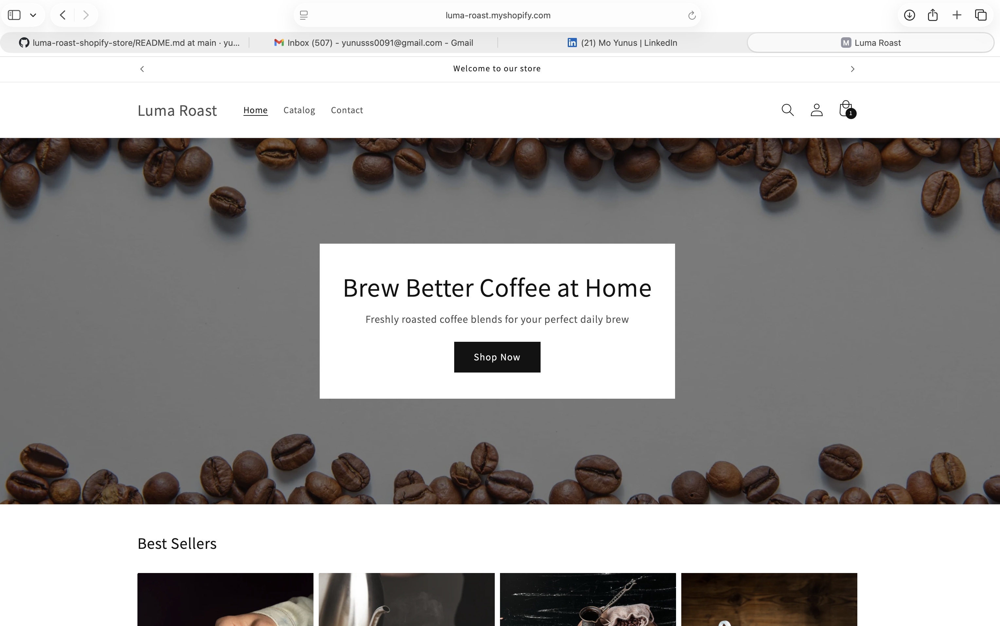
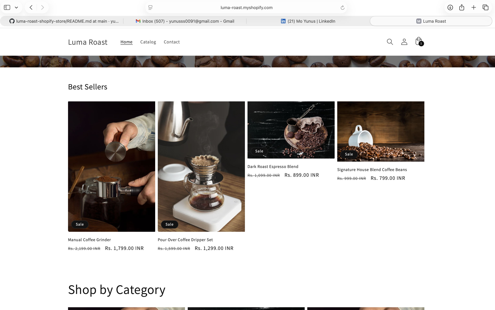
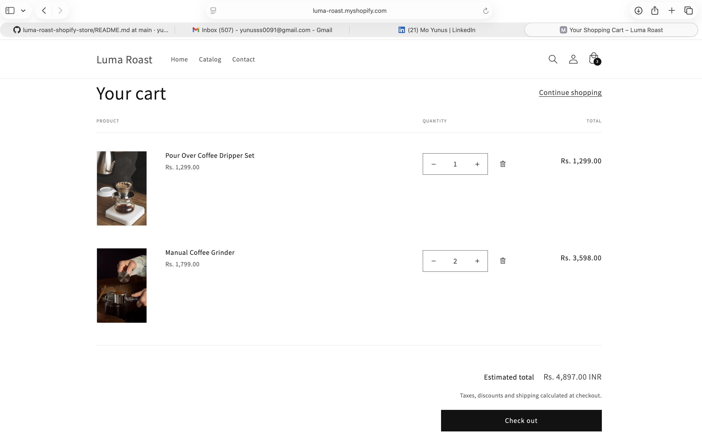

# ☕ Luma Roast – Shopify eCommerce Store

A premium Shopify eCommerce store built using the **Dawn theme**, designed with a modern UI, smooth user experience, and real-world eCommerce functionality.

---

## 🚀 Project Overview

**Luma Roast** is a modern coffee brand store focused on delivering a seamless and engaging online shopping experience.

This project demonstrates my ability to:

* Customize Shopify themes
* Design a clean and premium UI
* Implement real-world eCommerce features

---

## 🛠️ Tech Stack

* Shopify (Dawn Theme)
* Liquid (Shopify templating)
* HTML5, CSS3, JavaScript
* Judge.me Reviews Integration

---

## ✨ Features

* 🛍️ Fully functional product pages
* ⭐ Customer review system (Judge.me)
* 🎯 Featured collections & category layout
* 📱 Fully responsive (mobile + desktop)
* ⚡ Clean and optimized UI
* 🧾 Add to Cart & Buy Now functionality
* 🎨 Custom homepage design

---

## 📂 Project Structure

```
assets/
config/
layout/
locales/
sections/
snippets/
templates/
screenshots/
```

---

## 🖼️ Live Store

🔗 https://luma-roast.myshopify.com

---

## 📸 Screenshots

### 🏠 Homepage UI



---

### 🛍️ Product Page



---

### ⭐ Customer Reviews Section


---

### 🛒 Cart & Checkout



---

## 📌 Key Highlights

* Designed a premium coffee brand UI
* Implemented real-world eCommerce workflow
* Structured Shopify theme professionally
* Integrated third-party review system

---

## 🎯 What I Learned

* Shopify theme customization
* Liquid templating basics
* UI/UX improvement for eCommerce
* Real-world project deployment

---

## 👨‍💻 Author

**Mo Yunus**
Electronics & Communication Engineering Student

🔗 GitHub: https://github.com/yuns09
🔗 LinkedIn: (add your profile link)

---

## ⭐ Future Improvements

* Payment gateway integration
* Advanced search & filtering
* Blog & content pages
* Performance optimization

---

## 📢 Note

This project was developed as part of an internship/learning experience and represents a real-world Shopify store implementation.

---
